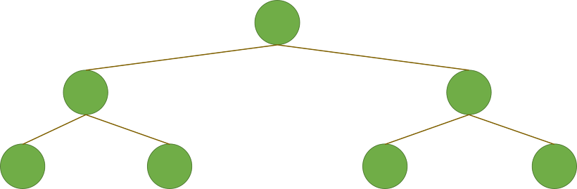
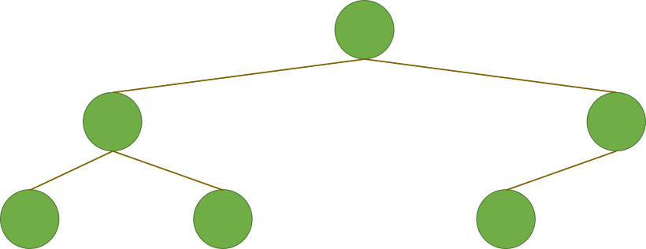
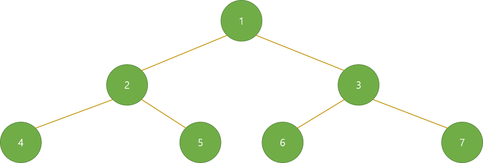
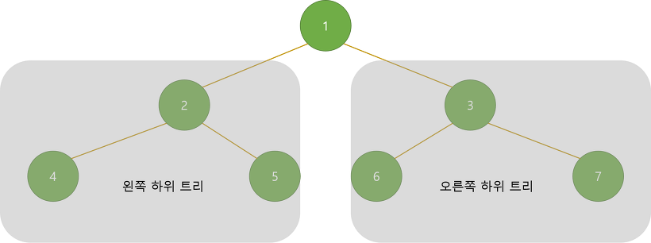

# Binary Tree

이진 트리는 차수가 2인 트리.

각각의 노드의 가지수가 2개이하로 이루어져 있는 트리.

**포화 이진 트리**

다시 말해 잎노드를 제외한 모든 노드들의 차수가 2 입니다. 이런 이진트리를 포화 이진 트리(Full Binary Tree)라고 부릅니다.



**완전 이진 트리**

포화 이진 트리는 아니지만 잎 노드들이 왼쪽부터 하나 씩 차곡차곡 채워진 트리를 완전 이진 트리(Complete Binary Tree)라고 부릅니다.



**구현**

차수가 0,1,2 중 하나이기 때문에, 굳이 LCRS ( Left-Child Right-Sibling ) 을 사용 할 필요가 없음.

```cpp
typedef struct _node{
    int data;
    struct _node *left, *right;
}Node;
```

```python
class Node:
	def __init__(self, data):
		self.data = data
		self.left = None
		self.right = None
```

**순회**





- Pre-Order ( 전위 순회 )

  1. 루트 노드에서 시작
  2. 왼쪽 하위 트리를 방문
  3. 오른쪽 하위 트리를 방문

  1 → 2 →4 → 5 → 3 → 6 → 7

  ```cpp
  void preOrderTraversal(Node node){
  	if(node != null){
  		visit(node);
  		preOrderTraversal(node.left);
  		preOrderTraversal(node.right);
  	}
  }
  ```

  ```python
  def pre_order_traversal(node):
  	if node:
  		visit(node)
  		pre_order_traversal(node.left)
  		pre_order_traversal(node.right)
  ```

- In-Order ( 중위 순회 )

  1. 왼쪽 하위 트리를 먼저 방문
  2. 루트 노드 방문
  3. 오른쪽 하위 트리를 방문

  4 → 2 → 5 → 1 → 6 → 3 → 7

  ```cpp
  void inOrderTraversal(Node node){
  	if(node != null){
  		inOrderTraversal(node.left);
  		visit(node);
  		inOrderTraversal(node.right);
  	}
  }
  ```

  ```python
  def in_order_traversal(node):
  	if node:
  		in_order_traversal(node.left)
  		visit(node)
  		in_order_traversal(node.right)
  ```

- Post-Order ( 후위 순회 )

  1. 왼쪽 하위 트리를 방문
  2. 오른쪽 하위 트리를 방문
  3. 루트 노드를 방문

  4 → 5 → 2 → 6 → 7 → 3 → 1

  ```cpp
  void postOrderTraversal(Node node){
  	if(node != null){
  		postOrderTraversal(node.left);
  		postOrderTraversal(node.right);
  		visit(node);
  	}
  }
  ```

  ```python
  def post_order_traversal(node):
  	if node:
  		post_order_traversal(node.left)
  		post_order_traversal(node.right)
  		visit(node)
  ```

```python
class Node:
	def __init__(self,data):
		self.data = data
		self.left = None
		self.right = None

class BinaryTree:
	def __init__(self):
		self.root = None

	def pre_order_traversal(self,node):
		if node:
			print(node.data, end=' ')
			self.pre_order_traversal(node.left)
			self.pre_order_traversal(node.right)

	def in_order_traversal(self,node):
		if node:
			self.in_order_traversal(node.left)
			print(node.data, end=' ')
			self.in_order_traversal(node.right)

	def post_order_traversal(self,node):
		if node:
			self.post_order_traversal(node.left)
			self.post_order_traversal(node.right)
			print(node.data, end=' ')


tree = BinaryTree()
tree.root = Node(1)
tree.root.left = Node(2)
tree.root.right = Node(3)
tree.root.left.left = Node(4)
tree.root.left.right = Node(5)
tree.root.right.left = Node(6)
tree.root.right.right = Node(7)

tree.pre_order_traversal(tree.root)
print()
tree.in_order_traversal(tree.root)
print()
tree.post_order_traversal(tree.root)
print()
```
