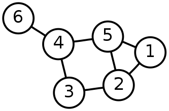
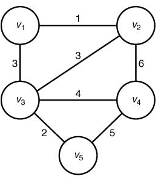
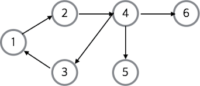

# 그래프

- 그래프란?

  아래 그림과 같은 형태로 생긴 것을 그래프라고 한다.

  동그라미 부분을 Vertex 혹은 Node ( 정점 )라고 부르고, 정점끼리 이어주는 선을 Edge(간선)이라고 부름.
  

- 그래프의 종류

  위 사진은 무향 그래프이면서 비 가중치 그래프임.

  만약 아래와 같이 간선마다 가중치가 있다면, 그 그래프는 가중치 그래프가 됨.

  

  무향 그래프는 간선이 양뱡향으로 작용하지만, 유향 그래프는 간선이 지정 된 방향으로만 작용함.

  아래 그림과 같이 방향이 표시 된 그래프를 유향 그래프라고 함.
  

- 용어
  - 정점, 노드, 버텍스, 꼭짓점 ( 전부 정점을 의미 )
  - 간선, 에지, 엣지, 변 ( 전부 간선을 의미 )
  - 차수(degree)
    - 한 정점에 이어져 있는 간선의 수를 나타냅니다.
    - 주로 무향 그래프에서 많이 사용합니다.
  - 인접(adjacent)
    - 두 개의 정점 사이에 간선이 존재한다면, 두 정점은 인접한 정점입니다.
  - 입력 차수(in-degree)
    - 한 정점으로 들어오는 간선의 수를 나타냅니다.
    - 주로 유향 그래프에서 많이 사용합니다.
  - 출력 차수(out-degree)
    - 한 정점에서 나가는 간선의 수를 나타냅니다.
    - 주로 유향 그래프에서 많이 사용합니다.
  - 사이클(cycle)
    - 한 정점에서 출발해 다시 시작 정점으로 돌아오는 경로를 말합니다.

## 그래프의 표현 방법

그래프는 대부분 2가지 중 하나의 표현 방법을 사용함.

- 인접 행렬 ( Adjacency Matrix )
  - 2차원 배열로 구현
- 인접 리스트 ( Adjacency List )
  - 연결 리스트 또는 동적 배열을 이용하여 구현

ex)


- 위 그래프를 인접 행렬로 나타내려면, 정점 간의 연결을 파악해야 함.

  1번 정점은 2, 5 와,

  2번 정점은 1, 3, 5 와,

  3번 정점은 2, 4 와,

  4는 3, 5, 6 과,

  5는 1, 2, 4 와,

  6은 4와 연결되어 있음.

  이 것을 행렬로 나타 낼 때는 arr[x][y] 의 값이 0이면 x 노드와 y노드가 연결 되어 있지 않다는 것이고, 반대로 1이면 연결되어 있다는 것을 의미하게 구현함.

  ```
  0 1 0 0 1 0
  1 0 1 0 1 0
  0 1 0 1 0 0
  0 0 1 0 1 1
  1 1 0 1 0 0
  0 0 0 1 0 0
  ```

- 인접 리스트로는 각 정점과 연결되어 있는 노드를 각 리스트에 삽입.

  ```
  1 - [2, 5]
  2 - [1, 3, 5]
  3 - [2, 4]
  4 - [3, 5, 6]
  5 - [1, 2, 4]
  6 - [4]
  ```

ex) 유향 그래프


- 인접 행렬로 나타내려면, 연결과 방향을 따져야 함.

  1은 2로 갈 수 있고,

  2는 4로 갈 수 있고,

  3은 1로 갈 수 있고,

  4는 3, 5, 6로 갈 수 있고,

  5와 6은 갈 수 있는 곳이 없음.

  무향 그래프와 마찬가지로, 0과 1로 나타내며 0이면 그 방향으로 갈 수 있다는 것이고 1이면 그 방향으로 이동 할 수 없다는 것을 나타냄.

  만약에 가중치가 존재한다면, 1이 아닌 가중치의 값을 넣어주면 됨.

  ```
  0 1 0 0 0 0
  0 0 0 1 0 0
  1 0 0 0 0 0
  0 0 1 0 1 1
  0 0 0 0 0 0
  0 0 0 0 0 0
  ```

- 인접 리스트로 나타내면

  ```
  1 - [2]
  2 - [4]
  3 - [1]
  4 - [3, 5, 6]
  5 - []
  6 - []
  ```

두 가지의 방법을 비교하여 장단점을 살펴보면,

- 인접 행렬을 이용하면 정점 간의 인접 여부를 빠르게 알 수 있지만 ( $O(1)$ ) 행렬로 저장할 때 메모리의 양이 $n^2$에 이르는 단점이 있음.
- 인접 리스트를 이용하면 정점 간의 인접 여부를 알아내기 위해 인접 리스트를 타고 순차 탐색을 해야하지만( $O(n)$ ) 정점과 간선 사이의 삽입이 빠르고 메모리를 적게 소모한다는 장점이 있음.

- 그래프의 정점의 개수가 많지 않거나 인접 여부를 빨리 알아야 한다면 인접 행렬을 사용
- 메모리 효율성을 우선시 하고 정점/간선의 입력이 자주 일어난다면 인접 리스트를 활용
