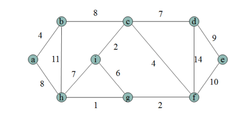
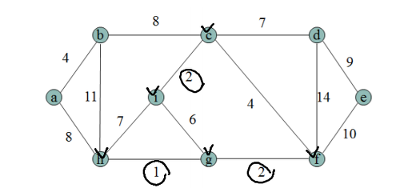
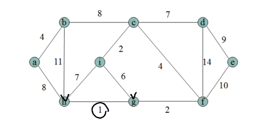
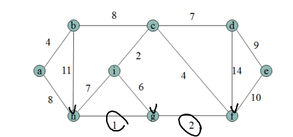

# Kruskal Algorithm and Prim Algorithm

[Minimum Spanning Tree(최소 신장 트리)](https://gmlwjd9405.github.io/2018/08/28/algorithm-mst.html)를 구할 때 쓰는 알고리즘.

### **Spanning Tree란?**

Spanning Tree는 그래프 이론에서 모든 정점을 포함하는 부분 그래프를 의미

### **Minimum Spanning Tree란?**

MST는 간선들의 가중치의 합이 최소가 되는 트리 형태인 Spanning Subgraph를 의미

## 크루스컬 알고리즘

- 크루스컬 알고리즘은 간선들 중에거 가중치가 가장 작은 간선부터 차례대로 연결.
- 그래프에서 정점들만 남겨둔 상태로 시작해서 가중치가 작은 간선부터 하나씩 그래프에 채워 준다고 생각하면 이해하기 쉬움.
- **연결 도중에 사이클이 생기면 그 간선은 무시하고 넘어감.**

예시)



먼저 가중치가 가장 작은 간선인 g-h를 연결.


그 다음으로 작은 간선인 i-c, g-f를 연결.



이 방식을 반복하면 아래와 같은 결과가 나옴.


구현 )

구현은 보통 union-find 자료구조를 통해 구현한다.

```python
N = 100
parent = [i for i in range(N+1)]
rank = [1 for _ in range(N+1)]

def find(v):
	if v == parent[v]:
		return v
	else:
		u = find(parent[v])
		parent[v] = u
		return u

def merge(u, v):
	u = find(u)
	v = find(v)
	if u == v:
		return True
	if rank[u] > rank[v]:
		u,v = v,u
	parent[u] = v
	if rank[u] == rank[v]:
		rank[v] += 1

def kruskal(graph):
    mst = []
		# 그래프를 weight를 기준으로 sort
    graph.sort()

    for w, u, v in graph:
				# 연결되어 있지않으면 연결해주고, mst로 append
        if find(u) != find(v):
            merge(u,v)
            mst.append((w,u,v))

    return mst

graph = [
    (7, 1, 2),
    (5, 1, 4),
    (7, 2, 1),
    (8, 2, 3),
    (9, 2, 4),
    (7, 2, 5),
    (8, 3, 2),
    (5, 3, 5),
    (5, 4, 1),
    (9, 4, 2),
    (7, 4, 5),
    (6, 4, 6),
    (7, 5, 2),
    (5, 5, 3),
    (15, 5, 4),
    (8, 5, 6),
    (9, 5, 7),
    (6, 6, 4),
    (8, 6, 5),
    (11, 6, 7),
    (9, 7, 5),
    (11, 7, 6),
]
```

## 프림 알고리즘

- 한 시작점과 현재 연결이 되어 있는 정점에서 뻗어 나가는 간선 중 가장 가중치가 작은 간선을 선택해 연결하면서 MST를 만듦.
- 가중치가 가장 작은 간선을 연결하되, 사이클이 생긴다면 가중치가 가장 작더라도 무시.

예시)


먼저 가중치가 가장 작은 간선인 g-h를 연결.



그 다음으로 g 또는 h에서 뻗어 나가는 간선 중 가장 가중치가 작은 간선인 f-g를 연결.



이 방식을 반복하면 아래와 같은 결과가 나옴.


구현)

```python
from collections import defaultdict
from heapq import heappush, heappop, heapify

def prim(start, edges):
    mst = []
    graph = defaultdict(list)
    for w, u, v in edges:
        graph[u].append((w, u, v))
        graph[v].append((w, v, u))

    connected = set([start])
    candidated_edge = graph[start]
    heapify(candidated_edge)

    while candidated_edge:
        w, u, v = heappop(candidated_edge)
        if v not in connected:
            connected.add(v)
            mst.append((w, u, v))

            for edge in graph[v]:
                if edge[2] not in connected:
                    heappush(candidated_edge, edge)
    return mst

edges = [
    (7, 1, 2),
    (5, 1, 4),
    (7, 2, 1),
    (8, 2, 3),
    (9, 2, 4),
    (7, 2, 5),
    (8, 3, 2),
    (5, 3, 5),
    (5, 4, 1),
    (9, 4, 2),
    (7, 4, 5),
    (6, 4, 6),
    (7, 5, 2),
    (5, 5, 3),
    (15, 5, 4),
    (8, 5, 6),
    (9, 5, 7),
    (6, 6, 4),
    (8, 6, 5),
    (11, 6, 7),
    (9, 7, 5),
    (11, 7, 6),
]

print(prim(1,edges))
```
