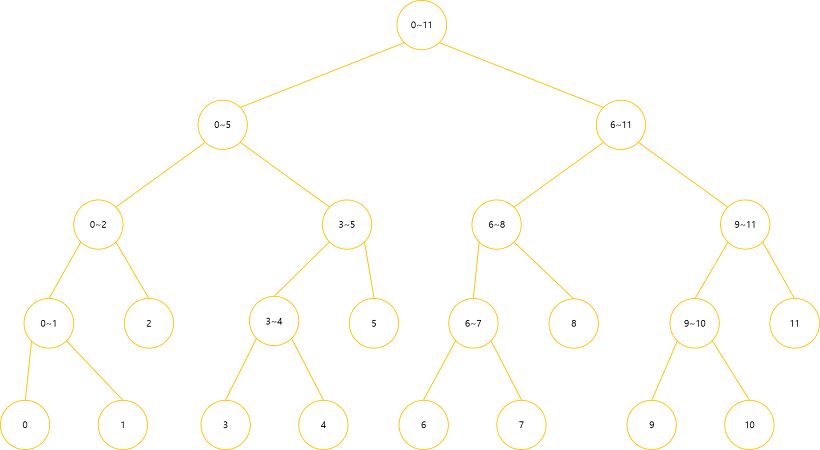

# Segment Tree

**Segment Tree란?**

특정 구간의 합, 곱, 최대값, 최소값 등을 효율적으로 구하는 자료구조.

이진 트리의 형태를 띄고 있으며 naive한 방식보다 훨씬 효율적으로 작업을 처리할 수 있습니다.

**처리해야 할 쿼리**

길이가 N인 arr이라는 배열에서 다음 두 가지 쿼리를 총 M번 수행해야 한다고 가정해봅시다.

1. 구간 [l, r]이 주어졌을 때 해당 구간의 합을 구하기
2. i번째 수를 v로 바꾸기

**Naive 풀이**

naive한 방식으로 하면

1번 쿼리는 최대 O(N)이 걸림.

2번 쿼리는 최대 O(1)이 걸림.

naive한 방식으로 하면 O(MN)이 걸리게 됩니다.

**Segment Tree의 아이디어**

세그먼트 트리의 리프 노드는 배열의 데이터를 의미하고, 리프 노드가 아닌 다른 노드들은 왼쪽 자식과 오른쪽 자식의 합을 저장.



### **구현**

**init**

세그먼트 트리를 생성.

배열의 크기가 N이면, 트리의 높이 H는 최대 ceil(logN)+1이 되고, 트리의 사이즈는 최대 (1«H)+1

**sum**

[left, right]의 합을 구함.

node가 담당하는 [start, end]구간과 구하고자 하는 [left, right]구간의 위치 관계는 다음 4가지로 분류 할 수 있음.

1. [left, right]가 [start, end]와 겹치지 않는 경우
2. [left, right]가 [start, end]를 완전히 포함하는 경우
3. [start, end]가 [left, right]를 완전히 포함하는 경우
4. [left, right]가 [start, end]와 겹쳐있는 경우 (1, 2, 3을 제외한 나머지 경우)

   1번의 경우에는 겹치는 부분이 없으므로 더 이상 탐색할 필요가 없습니다. 따라서 탐색을 종료합니다.

   2번의 경우에는 구해야 하는 구간이 [left, right]고, 현재 노드의 구간인 [start, end]은 이미 모두 포함이 되고, 그 **노드의 자식들도 모두 포함되기 때문에 tree[node]를 리턴**합니다.

   3, 4번의 경우에는 **왼쪽 서브 트리와 오른쪽 서브 트리에서 탐색을 다시 시작**합니다.

**update**

중간에 있는 특정 데이터의 값을 변경.

값을 변경하면, 그 값을 포함하는 다른 모든 노드들의 값도 변경해주어야 함.

i번째 수를 v로 변경한다면, 그 수가 얼만큼 변했는지 알아야 함.

변한 정도를 **diff**라고 하면 **diff = v - arr[i]**

**값을 변경하는 것은 두 가지 경우로 분류 됨.**

1. [start, end]에 i가 포함
2. 미포함 node 구간 안에 포함이 된다면 node의 값을 diff만큼 증가시켜 합을 변경.

   만약 포함하지 않는 경우에는 자손들 중에 i가 없으므로 탐색을 중단합니다.

구현)

```python
'''
init(arr: List, tree: List, node: int, start: int, end: int) -> int

arr : 배열
tree : 세그먼트 트리
node의 관할 영역 : [start,end]
'''
def init(arr, tree, node, start, end):
    if start == end: # 리프 노드인 경우
        tree[node] = arr[start]
        return tree[node]
    tree[node] = init(arr, tree, node*2, start,(start+end)//2) + init(arr, tree, node*2+1, (start+end)//2+1, end)
    return tree[node] # 리프 노드가 아니면 자식들의 합을 저장

'''
sum(arr: List, tree: List, node: int, start: int, end: int, left: int, right: int) -> int

arr : 배열
tree : 세그먼트 트리
node의 관할 영역 : [start,end]
구하자고 하는 영역: [left, right]
'''
def sum(arr, tree, node, start, end, left, right):
    if left > end or right < start: # 겹치는 구간이 없는 경우
        return 0

    if left <= start and end <= right: # [left, right]가 [start, end]를 완전히 포함하는 경우
        return tree[node]

    return sum(arr, tree, node*2, start, (start+end)//2, left, right) + sum(arr, tree, node*2+1, (start+end)//2+1, end, left, right)
			# [start, end]가 [left, right]를 완전히 포함하거나
		  # 두 구간이 겹쳐 있는 경우
			# 왼쪽 서브 트리와 오른쪽 서브 트리에서 다시 탐색 시작
'''
update(arr: List, tree: List, node: int, start: int, end: int, idx: int, diff: int) -> None

arr : 배열
tree : 세그먼트 트리
node의 관할 영역 : [start,end]
구하자고 하는 영역: [left, right]
idx: 바꾸자고 하는 위치
diff: 변하는 정도
'''

def update(arr, tree, node, start, end, idx, diff):
    if idx < start or idx > end: # 범위를 벗어남
        return
    tree[node] += diff # 범위에 포함되면 diff를 더해줌.
    if start != end: # 리프 노드가 아니면, 왼쪽 서브트리와 오른쪽 서브트리 모두 update
        update(arr, tree, node*2, start, (start+end)//2, idx, diff)
        update(arr, tree, node*2+1, (start+end)//2+1, end, idx, diff)
```

ex) 백준 2042

```python
# https://acmicpc.net/problem/2042
# 구간 합 구하기

import sys
input = lambda : sys.stdin.readline().rstrip()
input_multiple_int = lambda : map(int,input().split())

def init(arr, tree, node, start, end):
    if start == end:
        tree[node] = arr[start]
        return tree[node]
    tree[node] = init(arr, tree, node*2, start,(start+end)//2) + init(arr, tree, node*2+1, (start+end)//2+1, end)
    return tree[node]

def sum(arr, tree, node, start, end, left, right):
    if left > end or right < start:
        return 0

    if left <= start and end <= right:
        return tree[node]

    return sum(arr, tree, node*2, start, (start+end)//2, left, right) + sum(arr, tree, node*2+1, (start+end)//2+1, end, left, right)

def update(arr, tree, node, start, end, idx, diff):
    if idx < start or idx > end:
        return
    tree[node] += diff
    if start != end:
        update(arr, tree, node*2, start, (start+end)//2, idx, diff)
        update(arr, tree, node*2+1, (start+end)//2+1, end, idx, diff)

N, M, K = input_multiple_int()
arr = []
tree = [0 for _ in range(N*4)]

for _ in range(N):
    arr.append(int(input()))

init(arr, tree, 1, 0, N-1)

for _ in range(M+K):
    a,b,c = input_multiple_int()
    if a == 1:
        diff = c - arr[b-1]
        arr[b-1] = c
        update(arr, tree, 1, 0, N-1, b-1, diff)
    else:
        print(sum(arr, tree, 1, 0, N-1, b-1, c-1))
```
