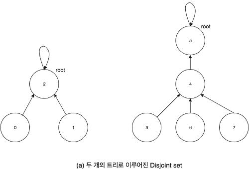
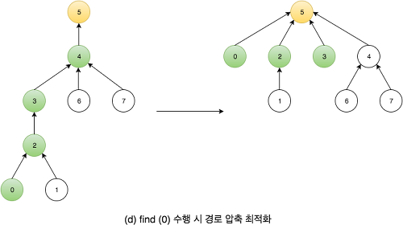

# Union Find

상호 배타적 집합 ( disjoint set )을 표현 할 때 쓰는 자료구조.

전체 집합을 공통원소가 없는 부분 집합들로 나눠서 저장하는 자료구조.

**Union Find의 연산**

1. init : 모든 원소가 모두 서로 다른 집합에 속하게 초기화하는 연산
2. Union : 두 원소를 한 집합으로 묶어 주는 연산
3. Find : 특정 원소가 어떤 집합에 속하는지 알려 주는 연산

a와 b가 같은 집합이라면 Union(a,b)를 이용해 서로 묶어주고, c와 d가 같은 집합에 있는지 판단하려면 Find(c) == Find(d)를 이용해 검사하면 됨.

**Union Find의 Naive한 구현**

- **배열을 이용한 구현**

  `group[i] = i번 원소가 속하는 집합의 번호` 로 정의

  **init**

  ```python
  def init(n):
  	for i in range(1,n+1):
  		group[i] = i
  ```

  **find**

  O(1)만에 구할 수 있음.

  ```python
  def find(v):
  	return group[v]
  ```

  **union**

  O(N)의 시간이 걸리며, 느리기 때문에 트리를 이용해보자.

  ```python
  def union(u, v, n):
  	u = find(u)
  	v = find(v)
  	if u == v:
  		return True
  	for i in range(1,n+1):
  		if group[i] == v:
  			group[i] = u
  	return False
  ```

- **트리를 이용한 구현**
  

  같은 집합에 속하는 원소끼리 하나의 트리로 묶어줌.

  트리에는 루트가 존재하기 때문에 집합의 번호를 루트노드의 번호로 정함.

  `parent[i] = i번 노드의 부모 노드` 로 정의하고, 루트의 parent는 자기자신이 되게 정의

  **init**

  ```python
  def init(n):
  	for i in range(1,n+1):
  		parent[i] = i
  ```

  **find**

  특정 노드에서 출발 해 부모 노드로 하나씩 올라가면 마지막에 루트 노드를 만날 수 있음. 해당 루트 노드의 번호를 반환.

  ```python
  def find(v):
  	if v == parent[v]:
  		return v
  	return find(parent[v])
  ```

  **union**

  두 원소가 다른 트리에 속해있다면, 즉 두 개의 트리의 루트가 다르다면 하나를 다른 트리의 자손으로 넣어서 두 트리를 합쳐줌.

  ```python
  def merge(u,v):
  	u = find(u)
  	v = find(v)
  	if u == v:
  		return True
  	parent[u] = v
  	return True
  ```

  Find연산의 수행시간은 트리의 깊이에 비례 함.

  Union연산은 Find연산을 기반으로 작동하기 때문에 Union연산의 수행시간 또한 트리의 깊이에 비례 함.

  

  트리를 이용해 구현 할 때, 위 그림과 같이 치우친 형태의 트리가 나올 수 있음.

  이렇게 되면, Union 및 Find 두 개의 연산 모두 O(n)이 되어버림. 이를 최적화하는 방법은 아래 두 가지.

**Union Find의 최적화**

- Union By Rank

  두 트리를 합칠 때, 높이가 더 낮은 트리를 높은 트리 밑에 넣어주면 어느 정도 해결 가능함.

  `rank[i] = i번 노드를 루트로 하는 서브트리의 대략적인 높이`

  `parent[i] = i번 노드의 부모 노드`

  위와 같이 rank와 parent를 정의하자.

  ```python
  def init(n):
  	for i in range(1,n+1):
  		parent[i] = i
  		rank[i] = 1

  def find(v):
  	if v == parent[v]:
  		return v
  	return find(parent[v])

  def merge(u, v):
  	u = find(u)
  	v = find(v)
  	if u == v:
  		return True
  	if rank[u] > rank[v]:
  		u,v = v,u
  	parent[u] = v
  	if rank[u] == rank[v]:
  		rank[v] += 1
  ```

- **Path Compression**

  

  이런 식으로 Find 연산을 수행할 때 거쳐가는 모든 노드를 루트 노드 바로 밑에 붙여주면, 다음에 Find 연산을 수행할 때 연산량이 많이 줄어들게 됩니다.

  이 방법을 `경로 압축 ( path compression )` 이라고 함.

  루트노드인 u를 찾았으면 v의 부모를 바로 루트노드로 바꿔 find 의 효율을 올려줄 수 있습니다.

  최종적으로 나온 Union Find의 코드는 아래와 같습니다.

  ```python
  def init(n):
  	for i in range(1,n+1):
  		parent[i] = i
  		rank[i] = 1

  def find(v):
  	if v == parent[v]:
  		return v
  	else:
  		u = find(parent[v])
  		parent[v] = u
  		return u

  def merge(u, v):
  	u = find(u)
  	v = find(v)
  	if u == v:
  		return True
  	if rank[u] > rank[v]:
  		u,v = v,u
  	parent[u] = v
  	if rank[u] == rank[v]:
  		rank[v] += 1
  ```
